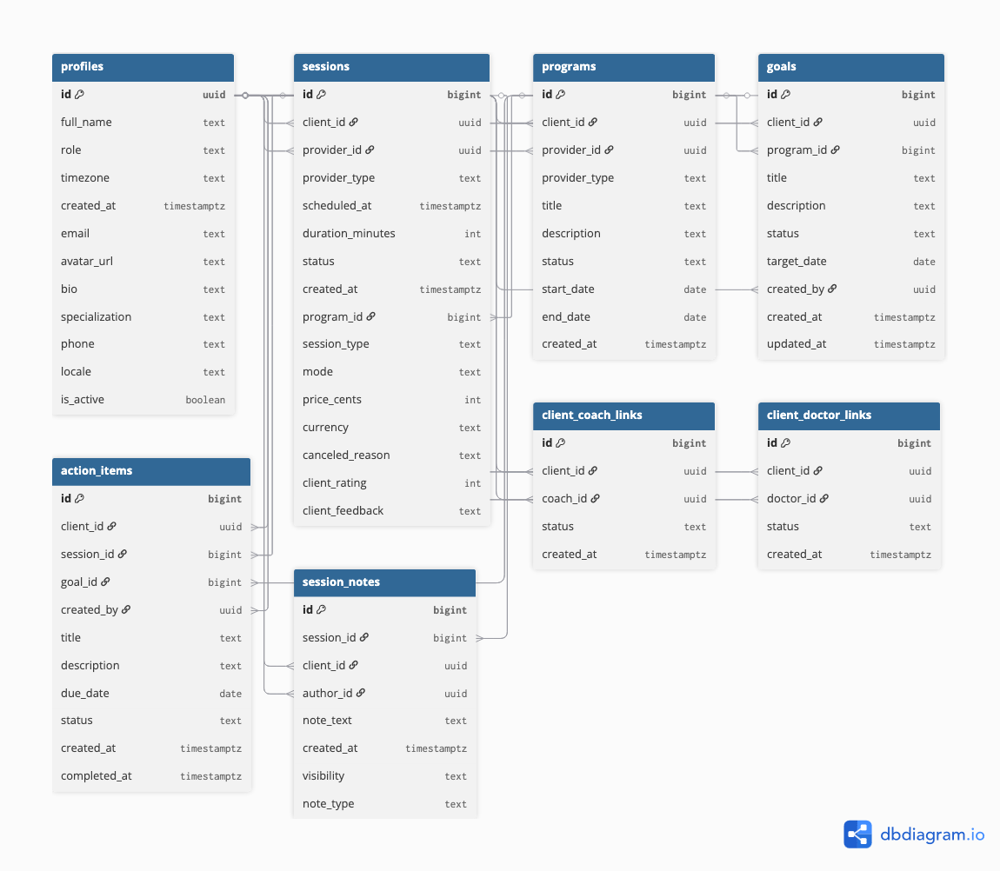

# Fertility Care Platform

A comprehensive fertility coaching and medical practice management platform built with Next.js, TypeScript, and Supabase.

## Use Cases

This project implements the following use cases:

- **UC1 – Client sees upcoming sessions on their dashboard**  
  **Status:** Implemented (`/dashboard`)  
  Clients can see a list of their upcoming sessions including provider, date/time, and status.

- **UC2 – Client views and filters their sessions**  
  **Status:** Implemented (`/sessions`)  
  Clients can view all their sessions (past and upcoming) and filter by status (scheduled/completed/canceled) and provider type (coach/doctor).

- **UC3 – Client views and manages their goals**  
  **Status:** Partially implemented (`/goals`)  
  Clients can view goals linked to their programs and see status (active/achieved/dropped).  
  *Note:* “Create New Goal” UI is present but not yet wired to an insert mutation (no goal creation from the UI yet).

- **UC4 – Client views action items linked to goals/sessions**  
  **Status:** Implemented (`/action-items`)  
  Clients can see their open / in-progress / done action items, including which session and goal they belong to.

- **UC5 – Provider sees linked clients with basic stats**  
  **Status:** Partially implemented (`/clients`)  
  Providers can see a list of their linked clients and basic stats (number of programs, sessions, goals).  
  *Note:* Deep drill-down per client is limited; no editing of client data from this view.

- **UC6 – User updates their profile**  
  **Status:** Implemented (`/profile`)  
  Users can update their profile fields (name, timezone, bio, specialization).  
  *Note:* Avatar upload is currently not implemented / stubbed.

Anything marked “Partially implemented” is deliberate to satisfy the requirement of stating what is and isn’t fully done.

## Features

- **Multi-Role Support**: Client, Coach, Doctor, and Admin portals
- **Session Management**: Schedule and manage appointments with providers
- **Programs**: Create and track personalized fertility programs
- **Goals Tracking**: Set and monitor fertility journey milestones
- **Action Items**: Task management with due dates and status tracking
- **Client Management**: Provider dashboard for managing client relationships
- **Profile Management**: Customizable user profiles with timezone and locale support

## Tech Stack

- **Framework**: Next.js 16 with App Router
- **Language**: TypeScript
- **Database**: Supabase (PostgreSQL)
- **Styling**: Tailwind CSS v4
- **Icons**: Lucide React
- **Date Handling**: date-fns

## Database Schema

The application supports the following main tables:

- `profiles` - User information for clients, coaches, doctors, and admins
- `sessions` - Appointment scheduling and management
- `programs` - Fertility programs linking clients with providers
- `goals` - Client goal tracking
- `action_items` - Task management from sessions and programs
- `session_notes` - Private and client-visible notes from sessions
- `client_coach_links` - Client-coach relationships
- `client_doctor_links` - Client-doctor relationships

## Data

For demonstration and assessment purposes, the project includes generated seed data.

Approximate row counts after running the seed script:

- **profiles**
  - 10 clients
  - 5 coaches
  - 3 doctors
- **client_coach_links**: ~10 rows (each client assigned one coach)
- **client_doctor_links**: ~10 rows (each client assigned one doctor)
- **programs**: ~20 rows (typically one coaching and one medical program per client)
- **sessions**: ~80 rows (about 4 sessions per program, mix of past and upcoming, coach/doctor)
- **session_notes**: notes for completed sessions, mix of `private` and `client_visible`
- **goals**: ~40 rows (2 per program, statuses `active` / `achieved` / `dropped`)
- **action_items**: ~120 rows (tasks linked to sessions and goals, statuses `open` / `in_progress` / `done` / `canceled`)

The data is generated using a SQL seed script (`db/seed.sql`) that:

- Creates demo users with predefined UUIDs for clients, coaches, and doctors.
- Randomly assigns providers to clients.
- Generates programs, sessions, goals, notes, and action items using `now()` with random offsets to cover past and upcoming dates.


## Entity–Relationship Diagram (ERD)

The data model is centered around `profiles`, `sessions`, and `programs`, with link tables for many-to-many relationships and additional tables for goals, action items, and session notes.



The ERD shows:

- **profiles** as the central user table (clients, coaches, doctors, admins)
- **sessions** linking clients and providers (coach/doctor)
- **programs** grouping sessions and goals
- **goals** and **action_items** modeling the client’s fertility journey tasks
- **session_notes** with visibility flags for client vs. provider/doctor
- **client_coach_links** and **client_doctor_links** as many-to-many relationships between profiles


## Getting Started

### Prerequisites

- Node.js 18+ installed
- A Supabase account and project

### Installation

1. Clone the repository:
```bash
git clone <your-repo-url>
cd fertility
```

2. Install dependencies:
```bash
npm install
```

3. Set up environment variables:
   - Copy `.env.local.example` to `.env.local`
   - Add your Supabase credentials:
```env
NEXT_PUBLIC_SUPABASE_URL=your_supabase_project_url
NEXT_PUBLIC_SUPABASE_ANON_KEY=your_supabase_anon_key
```

4. Set up your Supabase database:
   - Run the SQL schema provided in your Supabase SQL editor
   - Ensure Row Level Security (RLS) policies are configured appropriately

5. Run the development server:
```bash
npm run dev
```

6. Open [http://localhost:3000](http://localhost:3000) in your browser

## Project Structure

```
fertility/
├── app/
│   ├── action-items/    # Action items management
│   ├── clients/         # Client list for providers
│   ├── dashboard/       # Main dashboard
│   ├── goals/           # Goals tracking
│   ├── profile/         # User profile settings
│   ├── programs/        # Programs management
│   ├── sessions/        # Session scheduling and viewing
│   ├── layout.tsx       # Root layout
│   └── page.tsx         # Landing page
├── components/
│   └── navigation.tsx   # Sidebar navigation component
├── lib/
│   ├── database.types.ts # TypeScript types for database
│   └── supabase.ts      # Supabase client configuration
└── public/              # Static assets
```

## Key Pages

- `/` - Landing page with feature overview
- `/dashboard` - Role-specific dashboard with stats and upcoming sessions
- `/sessions` - View and manage all sessions
- `/programs` - Manage fertility programs
- `/goals` - Track fertility goals
- `/action-items` - Task management
- `/clients` - Client management (providers only)
- `/profile` - User profile settings

## Authentication

This demo currently uses placeholder user IDs. To implement authentication:

1. Set up Supabase Auth in your project
2. Replace `demo-user-id` and `demo-provider-id` with actual authenticated user IDs
3. Use `supabase.auth.getUser()` to get the current user
4. Implement RLS policies to secure data access

## Database Security

Recommended RLS policies:

```sql
-- Example: Clients can only view their own data
CREATE POLICY "Users can view own profile"
  ON profiles FOR SELECT
  USING (auth.uid() = id);

-- Example: Providers can view linked clients
CREATE POLICY "Providers can view linked clients"
  ON profiles FOR SELECT
  USING (
    EXISTS (
      SELECT 1 FROM client_coach_links
      WHERE client_id = profiles.id
        AND coach_id = auth.uid()
        AND status = 'active'
    )
  );
```

## Customization

### Changing User Role

To test different user roles, update the `userRole` constant in the layout files:

```typescript
// In app/dashboard/layout.tsx, app/sessions/layout.tsx, etc.
const userRole = 'coach' as 'client' | 'coach' | 'doctor' | 'admin'
```

### Adding New Features

1. Create new pages in the `app/` directory
2. Add navigation links in `components/navigation.tsx`
3. Update database types in `lib/database.types.ts` if adding new tables
4. Implement the UI using existing patterns from other pages

### Indexes and query performance

The SQL schema (`db/schema.sql`) defines several custom indexes tailored to the main UI queries:

- `sessions_client_status_scheduled_idx` and `sessions_provider_status_scheduled_idx`  
  These speed up dashboard and `/sessions` filters by `client_id` / `provider_id`, `status`, and `scheduled_at` (e.g. “upcoming scheduled sessions for this client/provider”).

- `goals_client_status_idx` and `action_items_client_status_due_idx`  
  These support the `/goals` and `/action-items` pages, which filter by client and status and often sort by due date.

- `client_coach_links_coach_status_idx` and `client_doctor_links_doctor_status_idx`  
  These make provider dashboards faster when loading all active clients for a given coach/doctor.

By indexing on the exact columns used in `WHERE` clauses and ordering, the application avoids full table scans and scales better as the dataset grows.

### Transactions and ACID

The file `db/functions.sql` defines a stored function `create_session_with_initial_action(...)` that:

1. Creates a new `sessions` row.
2. Creates an initial `action_items` row linked to that session.
3. Returns the new `session.id`.

Both inserts run inside a single database transaction (handled automatically by PostgreSQL for the function).  
If any part fails (e.g. foreign key violation), the transaction is rolled back and neither the session nor the action item is persisted.  
This demonstrates **ACID** properties:

- **Atomicity**: both rows are created together or not at all.  
- **Consistency**: foreign key constraints to `profiles`, `programs`, and `sessions` are preserved.  
- **Isolation**: concurrent calls do not interfere with each other’s in-progress changes.  
- **Durability**: once committed, data is stored in Supabase’s managed Postgres with WAL and backups.

### Advanced SQL example

The following query is used (or could be used) to power a provider dashboard, showing per-client stats:

```sql
SELECT
  c.id AS client_id,
  c.full_name AS client_name,
  COUNT(DISTINCT s.id) AS total_sessions,
  COUNT(DISTINCT CASE WHEN s.status = 'completed' THEN s.id END) AS completed_sessions,
  COUNT(DISTINCT g.id) AS total_goals,
  COUNT(DISTINCT CASE WHEN g.status = 'active' THEN g.id END) AS active_goals,
  COUNT(DISTINCT CASE WHEN ai.status IN ('open','in_progress') THEN ai.id END) AS open_action_items
FROM public.profiles p_provider
JOIN public.programs pr
  ON pr.provider_id = p_provider.id
JOIN public.profiles c
  ON c.id = pr.client_id
LEFT JOIN public.sessions s
  ON s.program_id = pr.id
LEFT JOIN public.goals g
  ON g.program_id = pr.id
LEFT JOIN public.action_items ai
  ON ai.client_id = c.id
WHERE p_provider.id = :provider_id
GROUP BY c.id, c.full_name
ORDER BY c.full_name;


## Build for Production

```bash
npm run build
npm start
```

## Deployment

This app can be deployed to:

- **Vercel** (recommended for Next.js)
- **Netlify**
- **Any platform supporting Node.js**

Make sure to set environment variables in your deployment platform.

## Contributing

1. Fork the repository
2. Create a feature branch
3. Make your changes
4. Submit a pull request

## License

MIT License - feel free to use this project for your own purposes.

## Support

For issues or questions, please open an issue in the GitHub repository.
